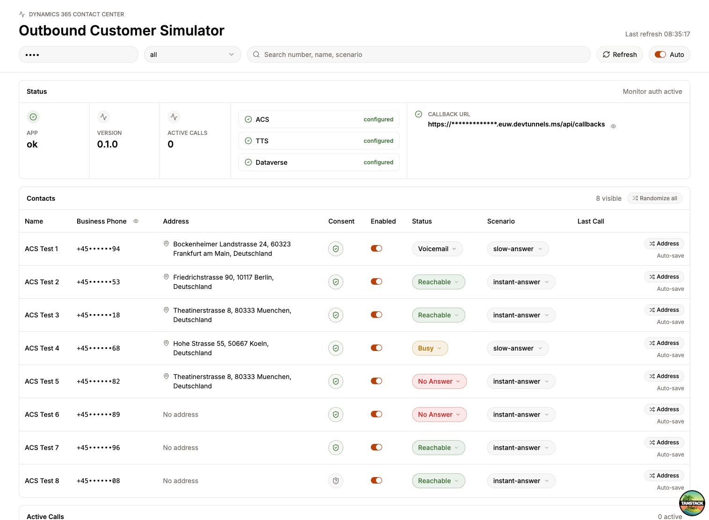
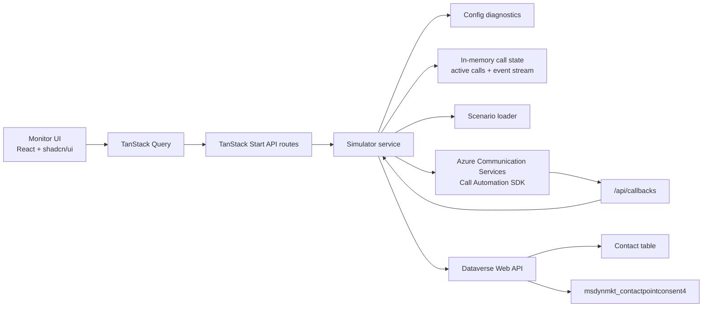
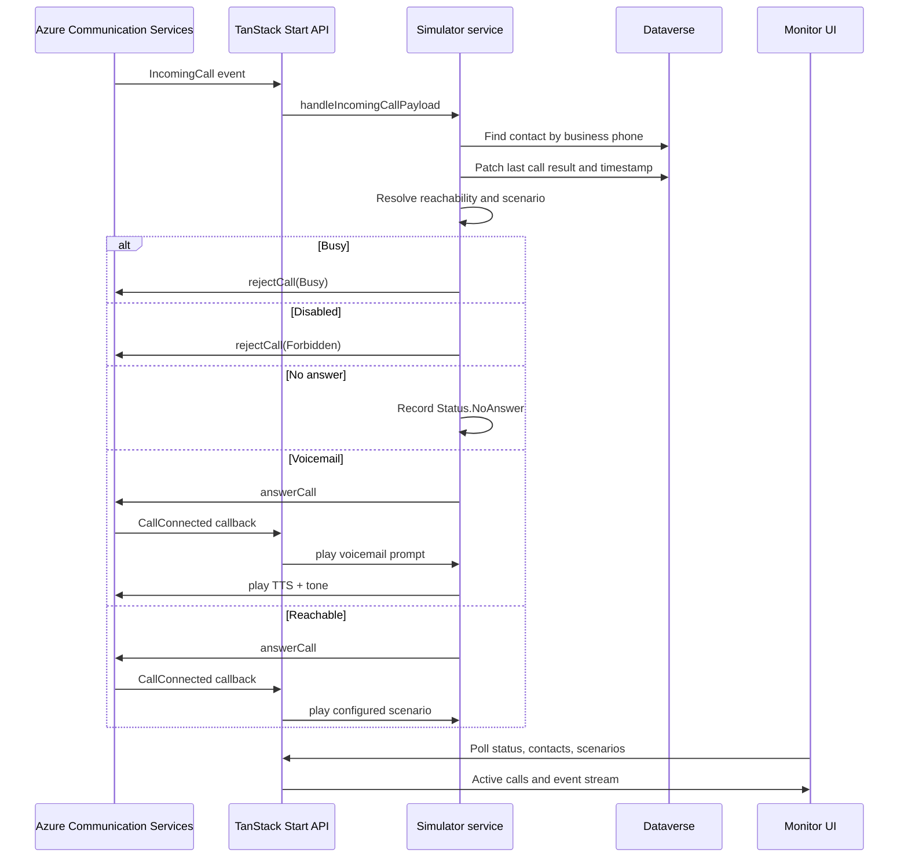
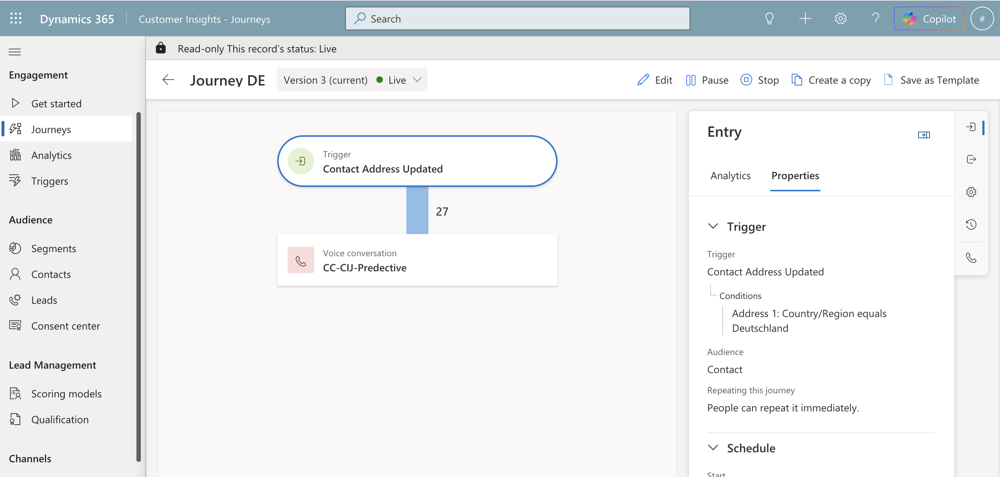
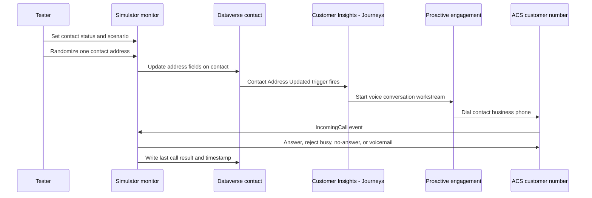
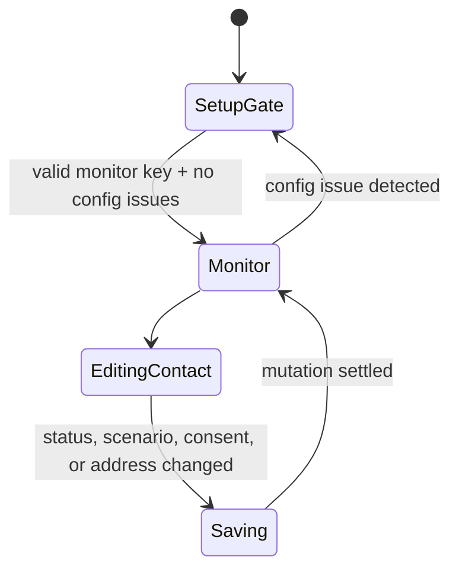

# Dynamics 365 Contact Center Outbound Customer Simulator

[](https://tanstack.com/start)
[](https://react.dev/)
[](https://www.typescriptlang.org/)
[](https://learn.microsoft.com/en-us/azure/communication-services/concepts/call-automation/call-automation)
[](https://learn.microsoft.com/en-us/power-apps/developer/data-platform/webapi/overview)

Testing proactive engagement in Dynamics 365 Contact Center is hard when the
behavior depends on many real customers, many phone numbers, and many call
outcomes. Dial modes such as preview, progressive, predictive, and Copilot mode
place outbound calls differently, and the system behavior only becomes clear
when some customers answer, some are busy, some do not answer, and some route to
voicemail.

This app replaces that pile of test phones with Azure Communication Services
Call Automation. Dynamics 365 places outbound calls as usual; the simulator
answers those calls as configurable customers, updates Dataverse, and records
what happened so teams can test proactive engagement pacing, routing, retry
behavior, abandonment handling, and agent/AI handoff scenarios in a repeatable
way.



> [!NOTE]
> The screenshot above shows the authenticated monitor data view. The monitor
> hides contacts, active calls, and the event stream until the monitor key and
> server-side integration settings are ready.

## Contents

- [What It Does](#what-it-does)
- [Why It Exists](#why-it-exists)
- [Architecture](#architecture)
- [Call Flow](#call-flow)
- [Quick Start](#quick-start)
- [Run With Dev Tunnels](#run-with-dev-tunnels)
- [Azure Communication Services Setup](#azure-communication-services-setup)
- [Dataverse Setup](#dataverse-setup)
- [How To Use It](#how-to-use-it)
- [Configuration](#configuration)
- [Monitor UI](#monitor-ui)
- [Dataverse Fields](#dataverse-fields)
- [API Routes](#api-routes)
- [Development](#development)
- [Troubleshooting](#troubleshooting)

## What It Does

| Area | Capability |
| --- | --- |
| Proactive engagement testing | Makes it practical to test outbound voice engagements without coordinating real people and phones. |
| Dial-mode validation | Helps observe how preview, progressive, predictive, and Copilot-led engagements behave against controlled customer outcomes. |
| Contact simulator | Lists Dataverse contacts or sample contacts and lets each number behave like a different customer. |
| Reachability | Supports answered, busy, no answer, voicemail, and disabled/unavailable states. |
| Scenario control | Selects TTS/playback scenarios dynamically from `config/scenarios.sample.json` or `SCENARIOS_PATH`. |
| ACS Call Automation | Answers incoming calls, rejects busy/forbidden calls, plays TTS, plays a voicemail tone, and hangs up. |
| Dataverse Web API | Reads and patches contact simulator fields, last call result, last call timestamp, addresses, and consent. |
| Consent center | Reads and updates voice consent through `msdynmkt_contactpointconsent4`. |
| Setup diagnostics | Shows missing or invalid ACS, TTS, Dataverse, callback URL, and monitor auth setup before exposing data. |
| Monitor security | Uses `MONITOR_API_KEY` for monitor endpoints and optional `WEBHOOK_SHARED_SECRET` for callbacks. |

## Why It Exists

Dynamics 365 Contact Center proactive engagement initiates outbound voice and
SMS customer outreach from configured workstreams. For voice, the dial mode
determines when outbound calls are placed, whether an AI agent or service
representative is involved, and how the system balances utilization with
customer experience.

That is difficult to test with only a few real devices:

- predictive dialing needs enough reachable and unreachable customers to show
  pacing decisions
- progressive dialing needs realistic available/busy/no-answer outcomes to
  validate representative reservation behavior
- preview dialing needs customer answer, voicemail, and cancel paths
- Copilot-led and AI-led flows need repeatable answered calls for escalation and
  handoff testing
- retry and frequency behavior depends on systemic outcomes such as busy, no
  answer, failed, and answering machine

This simulator gives every Dataverse contact a controllable phone behavior. A
tester can mark one contact as reachable, another as busy, another as voicemail,
and then run the same proactive engagement repeatedly to understand how Dynamics
365 responds without waiting on real people or swapping SIM cards between test
phones.

## Architecture



The Dataverse and Azure Communication Services calls stay server-side. The
browser communicates only with TanStack Start routes and server functions.

## Call Flow



## Quick Start

### macOS

1. Install Node.js and enable pnpm through Corepack.

   ```bash
   brew install node
   corepack enable
   ```

2. Install dependencies.

   ```bash
   pnpm install
   ```

3. Create your local environment file.

   ```bash
   cp .env.example .env
   ```

4. Start the TanStack Start dev server.

   ```bash
   pnpm dev
   ```

5. Open the monitor.

   ```text
   http://localhost:3000/
   ```

6. Enter the value from `MONITOR_API_KEY` in the monitor key field.

### Windows PowerShell

1. Install Node.js and enable pnpm through Corepack.

   ```powershell
   winget install OpenJS.NodeJS.LTS
   corepack enable
   ```

2. Install dependencies.

   ```powershell
   pnpm install
   ```

3. Create your local environment file.

   ```powershell
   Copy-Item .env.example .env
   ```

4. Start the TanStack Start dev server.

   ```powershell
   pnpm dev
   ```

5. Open the monitor.

   ```text
   http://localhost:3000/
   ```

6. Enter the value from `MONITOR_API_KEY` in the monitor key field.

> [!IMPORTANT]
> Real ACS callbacks require a public HTTPS URL. For local development, expose
> port `3000` through a tunnel and set `PUBLIC_BASE_URL` to that HTTPS origin.

## Run With Dev Tunnels

[Microsoft Dev Tunnels](https://learn.microsoft.com/en-us/azure/developer/dev-tunnels/) can expose the local TanStack Start server to Azure Communication Services and Event Grid during development.

### Install Dev Tunnels

macOS:

```bash
brew install --cask devtunnel
```

Windows PowerShell:

```powershell
winget install Microsoft.devtunnel
```

### Host The Local App

1. Start the app.

   ```bash
   pnpm dev
   ```

2. In a second terminal, sign in and expose port `3000`.

   ```bash
   devtunnel user login
   devtunnel host -p 3000 --allow-anonymous
   ```

3. Copy the printed HTTPS URL, for example:

   ```text
   https://<your-tunnel-id>-3000.<region>.devtunnels.ms/
   ```

4. Update `.env`.

   ```bash
   PUBLIC_BASE_URL=https://<your-tunnel-id>-3000.<region>.devtunnels.ms
   CALLBACK_PATH=/api/callbacks
   ```

5. Use these public endpoints in Azure:

   | Purpose | URL |
   | --- | --- |
   | Event Grid incoming call webhook | `https://<tunnel-host>/api/incomingCall` |
   | ACS Call Automation callback URL | `https://<tunnel-host>/api/callbacks` |

> [!WARNING]
> `--allow-anonymous` makes the tunnel reachable from the internet. Keep
> `MONITOR_API_KEY` and `WEBHOOK_SHARED_SECRET` set when exposing a local
> development server.

## Azure Communication Services Setup

The simulator works because the "customer" phone numbers in Dataverse are
Azure Communication Services PSTN numbers. Dynamics 365 Contact Center dials
those numbers during proactive engagement, ACS raises an `IncomingCall` event,
and this app decides whether the simulated customer answers, is busy, does not
answer, or reaches voicemail.

### 1. Create An ACS Resource

Create an Azure Communication Services resource and copy its connection string
into `.env`.

```bash
ACS_CONNECTION_STRING=endpoint=https://<resource>.communication.azure.com/;accesskey=<key>
```

### 2. Buy Or Acquire Phone Numbers

In the Azure portal, open the ACS resource, go to **Phone numbers**, and select
**Get** to purchase numbers. Use these numbers as test customer phone numbers
in Dataverse contact `Business Phone` fields.

Use E.164 format, for example:

```text
+4570726794
```

### 3. Configure Incoming Call Event Grid Subscription

Create an Event Grid subscription on the ACS resource:

| Setting | Value |
| --- | --- |
| Event type | `Microsoft.Communication.IncomingCall` |
| Endpoint type | Web Hook |
| Endpoint | `https://<PUBLIC_BASE_URL>/api/incomingCall` |

The app handles Event Grid `SubscriptionValidationEvent` requests on
`/api/incomingCall`, so Event Grid can validate the webhook during subscription
creation.

For realistic tests, add Event Grid filters for the ACS phone numbers used as
simulated customers. Filtering helps avoid duplicate or unintended incoming call
events when call routing gets more complex.

### 4. Configure Azure AI Services For TTS

Create or reuse an Azure AI Services resource that supports speech synthesis
and copy its endpoint into `.env`.

```bash
COGNITIVE_SERVICES_ENDPOINT=https://<resource>.cognitiveservices.azure.com/
DEFAULT_LOCALE=de-DE
DEFAULT_VOICE_NAME=de-DE-KatjaNeural
```

The app passes this endpoint to ACS Call Automation when answering a call. ACS
then uses it for `TextSource` and `SsmlSource` playback, including voicemail
prompts and the generated voicemail tone.

### 5. Connect It To Proactive Engagement

1. Add the ACS phone numbers to Dataverse contacts as `Business Phone` values.
2. Include those contacts in the Dynamics 365 Contact Center proactive
   engagement segment.
3. Configure the proactive engagement workstream and dial mode in Dynamics 365.
4. Start the engagement.
5. Use the monitor to set each simulated customer's status and observe calls,
   retries, event stream entries, and last-call field updates.

## Dataverse Setup

Import the managed solution before connecting the app to Dataverse:

[docs/CallSimOutbound_1_0_0_1_managed.zip](docs/CallSimOutbound_1_0_0_1_managed.zip)

The solution metadata is:

| Property | Value |
| --- | --- |
| Solution unique name | `CallSimOutbound` |
| Version | `1.0.0.1` |
| Managed | yes |
| Publisher | `joriskalz` |
| Publisher prefix | `jkalz` |
| Target table | `contact` |

After importing the solution, set:

```bash
DATAVERSE_CONTACT_FIELD_PREFIX=jkalz
```

The app reads normal contact fields such as `contactid`, `fullname`,
`telephone1`, and address columns. The simulator-specific behavior is stored in
custom columns on the `contact` table.

| Logical name | Display name | Type | Used for |
| --- | --- | --- | --- |
| `jkalz_ccsim_enabled` | `ccsim_enabled` | Two options | Includes or disables the contact for simulator handling. |
| `jkalz_ccsim_reachabilitystatus` | `CC Simulator Reachability Status` | Text | Simulated outcome: `reachable`, `busy`, `no_answer`, `voicemail`, `disabled`, or `unknown`. |
| `jkalz_ccsim_scenario` | `CC Simulator Scenario` | Text | Scenario name from the app scenario config, for example `instant-answer` or `slow-answer`. |
| `jkalz_ccsim_lastcallresult` | `CC Simulator Last Call Result` | Text | Last simulator result written when an incoming call is handled. |
| `jkalz_ccsim_lastcallat` | `CC Simulator Last Call At` | Date and time | Timestamp for the last handled incoming call. |
| `jkalz_customernumber` | `CustomerNumber` | Text | Optional helper/customer number field included in the solution. |

The app uses `telephone1` as the callable business phone number. For proactive
engagement tests, put the ACS phone numbers on the contacts that should behave
as simulated customers.

The Dataverse application user needs permission to read contacts and update
the simulator fields, address fields, and Customer Insights - Journeys consent
records.

## How To Use It

The most useful testing pattern is to let the simulator change a contact in
Dataverse and use that change as the entry trigger for a Customer Insights -
Journeys journey. For example, create a live journey whose trigger is **Contact
Address Updated**, with a condition such as `Address 1: Country/Region equals
Deutschland`, and then add a proactive voice conversation step.



In this setup, the simulator is both the test data controller and the simulated
called customer:



Typical workflow:

1. Import the managed solution and configure Dataverse access.
2. Create or select test contacts whose `Business Phone` values are ACS phone
   numbers.
3. Build a Customer Insights - Journeys journey with a contact update trigger,
   for example **Contact Address Updated**.
4. Add a proactive voice conversation step and choose the dial mode you want to
   test, such as preview, progressive, predictive, or Copilot-led.
5. Start the journey.
6. Open the simulator monitor and enter `MONITOR_API_KEY`.
7. Set each contact to a controlled outcome such as reachable, busy, no answer,
   voicemail, or disabled.
8. Click **Address** in a contact row to write a new random address directly to
   that Dataverse contact. Use **Randomize all** in the Contacts header when you
   want to update every visible simulator contact at once.
9. Watch the monitor's active calls and event stream to see how Dynamics 365 and
   ACS behave for that mix of customer outcomes.

The address buttons call the simulator API, which patches the Dataverse contact
address columns such as `address1_line1`, `address1_postalcode`,
`address1_city`, and `address1_country`. If your journey entry trigger is
**Contact Address Updated**, that Dataverse update is the action that starts the
journey. The row refreshes after the mutation, so the monitor shows the newly
written address next to the contact.

This makes dial-mode testing repeatable. You can run the same journey with
different contact states to compare pacing, retries, representative reservation,
AI handoff, voicemail handling, and no-answer behavior.

## Configuration

The app reads configuration from `.env`. Use `.env.example` as the starting
point.

### Required For Real Calls

| Variable | Purpose |
| --- | --- |
| `PUBLIC_BASE_URL` | Public HTTPS origin used by ACS callbacks. |
| `CALLBACK_PATH` | Callback route path, usually `/api/callbacks`. |
| `ACS_CONNECTION_STRING` | Azure Communication Services connection string. |
| `COGNITIVE_SERVICES_ENDPOINT` | Azure AI Services endpoint used for TTS playback. |
| `MONITOR_API_KEY` | Password-like key for the monitor UI and monitor API routes. |

### Dataverse

| Variable | Purpose |
| --- | --- |
| `DATAVERSE_URL` | Dataverse environment URL, for example `https://org.crm4.dynamics.com`. |
| `DATAVERSE_TENANT_ID` | Microsoft Entra tenant ID. |
| `DATAVERSE_CLIENT_ID` | App registration client ID. |
| `DATAVERSE_CLIENT_SECRET` | App registration client secret. |
| `DATAVERSE_CONTACT_FIELD_PREFIX` | Prefix for custom contact fields, for example `new` or `jkalz`. |

### Consent Center

| Variable | Purpose |
| --- | --- |
| `DATAVERSE_CONSENT_PURPOSE_ID` | Optional fixed consent purpose ID. |
| `DATAVERSE_CONSENT_PURPOSE_NAME` | Optional purpose name used for auto-discovery, for example `Commercial` or `Transactional`. |
| `DATAVERSE_CONSENT_SOURCE` | Option value for consent source. |
| `DATAVERSE_CONSENT_REASON` | Audit reason written to consent records. |

When `DATAVERSE_CONSENT_PURPOSE_ID` is empty, the app discovers available
purposes from:

```http
GET /api/data/v9.2/msdynmkt_purposes?$select=msdynmkt_purposeid,msdynmkt_name,msdynmkt_type,msdynmkt_enforcementmodel,msdynmkt_smsenforcementmodel,msdynmkt_voiceenforcementmodel
```

## Monitor UI

The monitor is optimized for repeated test operations:

- masked phone numbers with click-to-copy feedback
- callback URL masking, reveal toggle, and click-to-copy
- status popovers for reachability changes
- scenario popovers based on configured scenarios
- autosave with mutation status
- voice consent popovers for opt-in, opt-out, and removal
- random address generation for one contact or all contacts
- setup gate when required configuration is missing



## Dataverse Fields

The contact list expects the simulator fields from the managed solution above,
using the configured `DATAVERSE_CONTACT_FIELD_PREFIX`.

| Logical name pattern | Meaning |
| --- | --- |
| `<prefix>_ccsim_enabled` | Whether this contact should be used by the simulator. |
| `<prefix>_ccsim_reachabilitystatus` | Reachability behavior such as reachable, busy, no answer, voicemail, or disabled. |
| `<prefix>_ccsim_scenario` | Scenario name used for playback behavior. |
| `<prefix>_ccsim_lastcallresult` | Last simulator call result written when an incoming call is handled. |
| `<prefix>_ccsim_lastcallat` | Last simulator call timestamp. |

Consent is contact-point based and uses:

```text
msdynmkt_contactpointconsent4
```

## API Routes

| Route | Auth | Purpose |
| --- | --- | --- |
| `GET /health` | none | Basic process and integration health. |
| `GET /api/setup` | none | Safe setup diagnostics for the setup gate. |
| `GET /api/status` | monitor key | App status, active calls, recent events, and config status. |
| `GET /api/contacts` | monitor key | Contact list from Dataverse or sample data. |
| `PATCH /api/contacts/:contactId/simulator-status` | monitor key | Update enabled, reachability, scenario, or last-call fields. |
| `GET /api/scenarios` | monitor key | Scenario definitions. |
| `PATCH /api/contacts/:contactId/consent` | monitor key | Set voice consent for a contact point. |
| `DELETE /api/contacts/:contactId/consent` | monitor key | Remove the voice consent record. |
| `PATCH /api/contacts/:contactId/address` | monitor key | Set a random address for one contact. |
| `PATCH /api/contacts/address` | monitor key | Set random addresses for all contacts. |
| `POST /api/incomingCall` | optional webhook secret | Event Grid incoming call endpoint. |
| `POST /api/callbacks` | optional webhook secret | ACS Call Automation callback endpoint. |
| `GET /api/media/voicemail-tone/wav` | none | Generated voicemail tone WAV. |

## Development

| Command | Description |
| --- | --- |
| `pnpm dev` | Start the dev server on port `3000`. |
| `pnpm typecheck` | Run TypeScript checks. |
| `pnpm lint` | Run ESLint. |
| `pnpm test` | Run Vitest tests. |
| `pnpm build` | Build client and server output. |
| `pnpm format` | Format source files with Prettier. |

The app uses:

- TanStack Start for routing and server routes
- TanStack Query for client/server state
- shadcn/ui style primitives
- Base UI for accessible popover/select interactions
- Azure Communication Services Call Automation SDK
- Dataverse Web API via server-side token acquisition

## Troubleshooting

<details>
<summary>The monitor shows "Setup required"</summary>

Use the issue cards on the page. They list the missing `.env` variables and link
to the relevant Microsoft Learn page where applicable. Contacts, active calls,
and events are intentionally hidden while setup is incomplete.

</details>

<details>
<summary>Callback URL must use HTTPS</summary>

Set `PUBLIC_BASE_URL` to a public HTTPS tunnel or deployed HTTPS origin. ACS
cannot call back to `http://localhost:3000`.

</details>

<details>
<summary>Contacts are not coming from Dataverse</summary>

Check `DATAVERSE_URL`, `DATAVERSE_TENANT_ID`, `DATAVERSE_CLIENT_ID`,
`DATAVERSE_CLIENT_SECRET`, and `DATAVERSE_CONTACT_FIELD_PREFIX`. If these are
empty, the app falls back to sample contacts.

</details>

<details>
<summary>Busy status still answers the call</summary>

The busy behavior should call `rejectCall` with the `Busy` reason. Check the
event stream for `Reject.Busy`. If ACS still answers, verify the contact phone
number matches the incoming call target and that the contact status was saved.

</details>

## References

- [Configure proactive engagement in Dynamics 365 Contact Center](https://learn.microsoft.com/en-us/dynamics365/contact-center/administer/configure-proactive-engagement?tabs=voice)
- [Dial modes for proactive engagement](https://learn.microsoft.com/en-us/dynamics365/contact-center/administer/proactive-engagement-dial-modes)
- [Microsoft Dev Tunnels](https://learn.microsoft.com/en-us/azure/developer/dev-tunnels/)
- [Dev Tunnels command-line reference](https://learn.microsoft.com/en-us/azure/developer/dev-tunnels/cli-commands)
- [Azure Communication Services Call Automation](https://learn.microsoft.com/en-us/azure/communication-services/concepts/call-automation/call-automation)
- [ACS IncomingCall and Event Grid concepts](https://learn.microsoft.com/en-us/azure/communication-services/concepts/call-automation/incoming-call-notification)
- [Get and manage ACS phone numbers](https://learn.microsoft.com/en-us/azure/communication-services/quickstarts/telephony/get-phone-number)
- [Make an outbound call with Call Automation](https://learn.microsoft.com/en-us/azure/communication-services/quickstarts/call-automation/quickstart-make-an-outbound-call)
- [Call Automation play action](https://learn.microsoft.com/en-us/azure/communication-services/how-tos/call-automation/play-action)
- [Dataverse Web API](https://learn.microsoft.com/en-us/power-apps/developer/data-platform/webapi/overview)
- [Dataverse authentication](https://learn.microsoft.com/en-us/power-apps/developer/data-platform/authentication)
- [Customer Insights - Journeys consent records](https://learn.microsoft.com/en-us/dynamics365/customer-insights/journeys/consent-record-creation)
